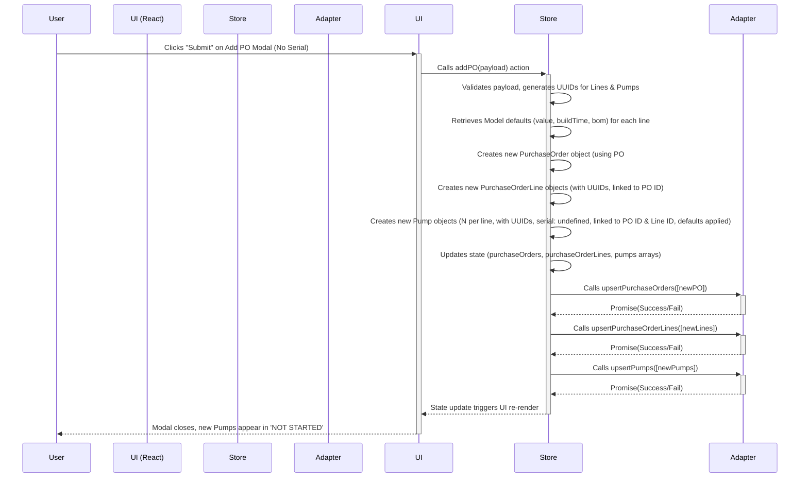
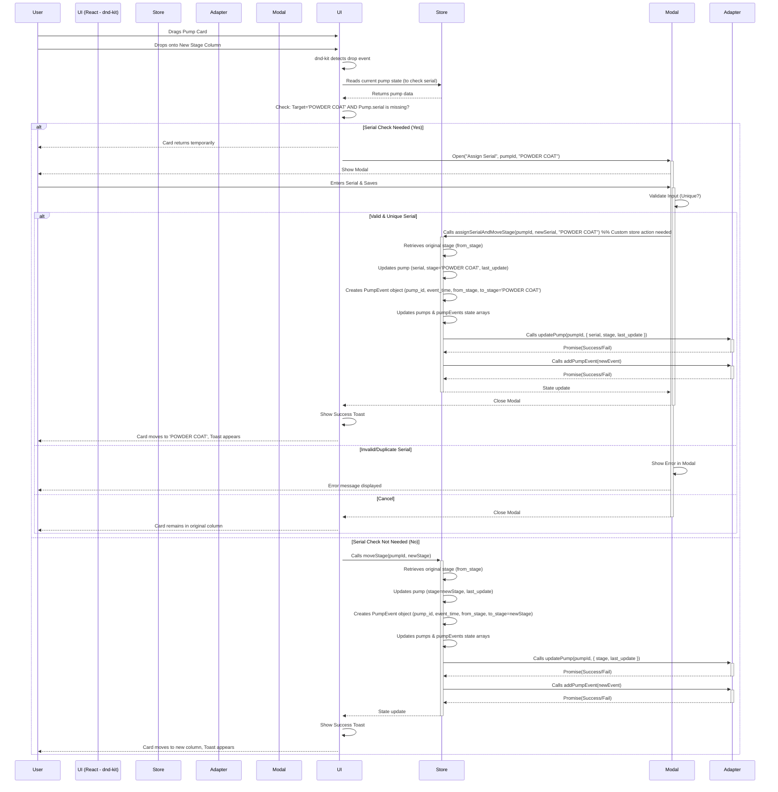

# PumpTracker Lite Fullstack Architecture Document

## Introduction

This document outlines the complete **client-centric architecture** for PumpTracker Lite. It covers the frontend implementation (React/Vite/Tailwind/ShadCN) and its integration with a **swappable data persistence layer** (local default, optional Supabase via an Adapter Pattern). The final deliverable for this Proof of Concept will be packaged as a **Tauri desktop application**.

This architecture serves as the single source of truth for AI-driven development, ensuring consistency across the technology stack and supporting key PRD goals such as **local-first operation, speed, and usability**. This unified document addresses both frontend and backend (adapter) concerns, suitable for this streamlined application. The Tauri wrapping occurs *after* the web application is built, acting primarily as a delivery container for the POC.

### Starter Template or Existing Project

N/A - Greenfield project initialized using Vite (`pnpm create vite pumptracker-lite --template react-ts`). All subsequent configuration (Tailwind, ShadCN, Tauri, etc.) will be added manually based on this architecture and the implementation spec.

### Change Log

| Date             | Version | Description                   | Author         |
| :--------------- | :------ | :---------------------------- | :------------- |
| October 24, 2025 | 1.0     | Initial draft based on PRD v2.1 & UI Spec v1.1 | Winston (Arch) |
| October 24, 2025 | 1.1     | Refined Intro clarity (Tauri role, Adapters) | Winston (Arch) |
| October 27, 2025 | 1.2     | Incorporated Model entity, JSON source, revised schema | Winston (Arch) |

---

## High Level Architecture

### Technical Summary

PumpTracker Lite is architected as a **client-centric Single-Page Application (SPA)** built with **React 19, Vite, and TypeScript**. The UI utilizes **ShadCN/ui primitives styled with Tailwind CSS** and enhanced with **Framer Motion**. State management is handled globally via **Zustand**, persisting data primarily to `localStorage` through a default **`LocalAdapter`**. An optional **`SupabaseAdapter`** allows for future cloud persistence using the **Adapter Pattern**. This architecture directly supports the PRD goals of **local-first operation, speed, and usability** for the POC phase.

---

### Platform and Infrastructure Choice

Given the local-first, client-centric nature of the POC and the decision to build as a web app initially:

**Recommendation:** Utilize a **Static Hosting Platform** like Vercel or Netlify for initial deployment and feedback collection. This offers the fastest path to sharing the POC. The optional **Supabase** backend remains the choice for cloud persistence if needed later.

```markdown
**Platform:** Static Hosting (e.g., Vercel, Netlify) for the React SPA.
**Key Services:** CDN for static assets. (Optional Future: Supabase for database/backend).
**Deployment Host and Regions:** Global CDN provided by the static hosting platform.
```

### Repository Structure

Initially, a single repository containing the Vite/React application is sufficient.

**Structure:** Single Repository (standard Vite project structure).
**Monorepo Tool:** N/A for initial web app POC.
**Package Organization:** Standard Vite/React conventions (`src/components`, `src/pages`, `src/store`, `src/adapters`, etc.).

### High Level Architecture Diagram

```mermaid
graph LR
    User --> App[React SPA (Vite)];
    App --> Store[Zustand Store];
    Store --> Adapter{Data Adapter};
    Adapter --> Local[LocalAdapter (localStorage)];
    Adapter --> Supa(SupabaseAdapter);

    subgraph Browser/Tauri Wrapper
        App
        Store
        Adapter
        Local
    end

    subgraph Cloud (Optional)
        Supa --> DB[(Supabase DB)];
    end

    style Supa fill:#ddd,stroke:#aaa,stroke-dasharray: 5 5
    style DB fill:#ddd,stroke:#aaa,stroke-dasharray: 5 5
```


### Architectural Patterns

* **Single-Page Application (SPA)**: The entire UI runs in the browser, managed by React and React Router.
    * **Rationale**: Provides a fluid, app-like user experience.
* **Component-Based UI**: Interface built from reusable React components using ShadCN/ui primitives.
    * **Rationale**: Promotes modularity, maintainability, and consistency.
* **Global State Management (Zustand)**: Single store holds application state (pumps, POs, models, filters).
    * **Rationale**: Simple and effective for a single-user app.
* **Adapter Pattern (Data Persistence)**: Abstracting persistence allows swapping `LocalAdapter` (`localStorage`) and `SupabaseAdapter`.
    * **Rationale**: Decouples logic from storage, enabling local-first and future cloud options.

---

### Tech Stack

This section details the specific technologies and versions selected for PumpTracker Lite. Development must use these exact versions.

#### Technology Stack Table

| Category                   | Technology             | Version                 | Purpose                           | Rationale                                          |
| :------------------------- | :--------------------- | :---------------------- | :-------------------------------- | :------------------------------------------------- |
| Frontend Language          | TypeScript             | `^5.x`                  | Primary development language      | "Strong typing, tooling, aligns with Vite template" |
| Frontend Framework         | React                  | `^19`                   | UI library/framework              | Specified in core architecture                   |
| UI Component Primitives    | ShadCN/ui              | latest                  | Base UI building blocks           | Specified for UI components                        |
| State Management           | Zustand                | latest                  | Global client-side state          | Chosen for simplicity and effectiveness           |
| Routing                    | React Router           | latest                  | Client-side navigation            | "Standard for React SPAs, specified for routes"  |
| Backend Language           | N/A                    | N/A                     | N/A                               | "Client-centric app, logic in React/TS"          |
| Backend Framework          | N/A                    | N/A                     | N/A                               | Persistence handled by Adapters                    |
| API Style                  | N/A                    | N/A                     | N/A                               | "Direct interaction with Adapters, not a separate API" |
| Database                   | LocalStorage           | Browser API             | Default local persistence         | Core requirement for local-first POC           |
| Database (Optional)        | Supabase (Postgres)    | Cloud Service / latest  | Optional cloud persistence        | Specified as optional adapter target             |
| Data Source (Models)       | JSON File              | `src/data/models.json`  | Model Defaults Configuration      | Chosen for MVP simplicity                          |
| Data Processing            | PapaParse              | latest                  | CSV/JSON parsing (Post-MVP)       | For future upload feature                          |
| CSS Framework              | Tailwind CSS           | latest                  | Utility-first styling             | Specified for all styling                          |
| Motion / Animation         | Framer Motion          | latest                  | "UI animations, micro-interactions" | Required for UI polish per specs                   |
| Charting                   | Recharts               | latest                  | Dashboard visualizations          | Specified for charts                               |
| Drag & Drop                | @dnd-kit/core          | latest                  | Kanban board interactions         | Specified for Kanban functionality                 |
| Build Tool                 | Vite                   | latest                  | Frontend build/dev server         | Chosen for speed and modern tooling                |
| Package Manager            | pnpm                   | latest                  | Dependency management             | Specified in build/run commands                    |
| Icons                      | Lucide Icons           | latest (lucide-react)   | UI Icons                          | Recommended for consistency with ShadCN            |
| Utility Lib                | "clsx, nanoid"         | latest                  | "Class merging, ID generation"    | Standard utilities for React/Tailwind/State      |
| Desktop Wrapper (Target)   | Tauri                  | latest                  | Optional Desktop container        | Post-build packaging option                      |

---

## Data Models (Revised with Model Entity & JSON Source)

This section outlines the core data structures, defined canonically in `src/types.ts`. Model defaults are sourced from `src/data/models.json`. IDs should now be treated as UUIDs where applicable.

### Model (Sourced from models.json)

* **Purpose**: Represents a standard pump model configuration, holding default values, Bill of Materials, and lead time estimates.
* **Source**: Defined in `src/data/models.json` (transformed from the provided `pumptracker-data.json`) and loaded into Zustand state on application startup.
* **Core Attributes**:
    * `id`: `string` - Model identifier (e.g., "DD-6 SAFE").
    * `description`: `string` - Model description.
    * `price`: `number | null` - Default monetary value (null if not set). Maps to `defaultValue` in previous discussions.
    * `defaultBuildTime`: `number` - Estimated total build time in days.
    * `bom`: `Record<string, string | null>` - Simplified BOM structure mapping component type (e.g., "engine") to part description/identifier.
    * `leadTimes`: `Record<string, number>` - Estimated days per production stage.
* **TypeScript Definition**: (To be added/updated in `src/types.ts`)
```typescript
// Simplified BOM based on provided JSON
type BOM = Record<string, string | null>; // e.g., { engine: "HATZ 1B50E x1", gearbox: null }

// Detailed Lead Times per stage
interface LeadTimes {
  fabrication: number;
  powder_coat: number;
  assembly: number;
  testing: number;
  total_days: number; // This maps to defaultBuildTime
}

interface Model {
  id: string; // Corresponds to 'model' field in JSON
  description: string;
  price: number | null; // Corresponds to 'price' field
  defaultBuildTime: number; // Derived from leadTimes.total_days
  bom: BOM;
  leadTimes: LeadTimes;
}
```

* **Example `src/data/models.json` Structure (Transformed Map)**:
```json
{
  "DD-4S": {
    "id": "DD-4S",
    "description": "4” Double Diaphragm",
    "price": 20000,
    "defaultBuildTime": 9.75, // Updated from JSON
    "bom": { "engine": "HATZ 1B50E", "gearbox": "RENOLD WM6", "control_panel": "DSEE050" },
    "leadTimes": { "fabrication": 1.5, "powder_coat": 7, "assembly": 1, "testing": 0.25, "total_days": 9.75 }
  },
  // ... other models keyed by their name ...
}
```


<hr/>

### Pump

* **Purpose**: Represents a single pump unit undergoing production.
* **Core Attributes**: `id` (UUID), `serial?` (number - unique if not null), `po_id` (string), `po_line_id?` (UUID), `customer` (string), `model_id` (string), `stage` (Stage enum), `priority` (Priority enum), `powder_color?` (string), `last_update` (string ISO), `value` (number), `build_time` (number - Sourced from `Model.defaultBuildTime`), `bom` (BOM type - Sourced from `Model.bom`), `scheduled_start?` (string ISO), `scheduled_end?` (string ISO), `promise_date?` (string ISO), `org_id` (UUID).
* **Relationships**: Links to `PurchaseOrder` via `po_id`. Links to `PurchaseOrderLine` via `po_line_id`. References `Model` via `model_id`. One-to-many with `PumpEvent`.
* **TypeScript Definition**: (Updated in `src/types.ts`)
```typescript
 // Define Enums based on SQL
 export enum Stage {
   NOT_STARTED = 'NOT STARTED',
   FABRICATION = 'FABRICATION',
   POWDER_COAT = 'POWDER COAT',
   ASSEMBLY = 'ASSEMBLY',
   TESTING = 'TESTING',
   SHIPPING = 'SHIPPING'
 }
 export enum Priority {
   LOW = 'Low',
   NORMAL = 'Normal',
   HIGH = 'High',
   RUSH = 'Rush',
   URGENT = 'Urgent'
 }
 export interface Pump {
   id: string; // UUID
   serial?: number;
   po_id: string;
   po_line_id?: string; // UUID
   customer: string;
   model_id: string;
   stage: Stage;
   priority: Priority;
   powder_color?: string;
   last_update: string; // ISO
   value: number;
   buildTime: number; // Sourced from Model
   bom: BOM; // Sourced from Model
   scheduled_start?: string; // ISO
   scheduled_end?: string; // ISO
   promise_date?: string; // ISO
   org_id: string; // UUID
 }
```


<hr/>

### PurchaseOrder

* **Purpose**: Represents a customer's order.
* **Core Attributes**: `id` (string PO#), `customer` (string), `dateReceived?` (string ISO), `promiseDate?` (string ISO), `notes?` (string), `org_id` (UUID). `lines` array REMOVED.
* **Relationships**: One-to-many with `PurchaseOrderLine` via `PurchaseOrderLine.po_id`.
* **TypeScript Definition**: (Updated in `src/types.ts`)
```typescript
export interface PurchaseOrder {
  id: string; // PO number
  customer: string;
  dateReceived?: string; // ISO
  promiseDate?: string; // ISO default
  notes?: string;
  org_id: string; // UUID
}
```


<hr/>

### PurchaseOrderLine (Normalized)

* **Purpose**: Represents a single line item, normalized.
* **Core Attributes**: `id` (UUID), `po_id` (string), `line_no` (number), `model_id` (string), `quantity` (number), `priority` (Priority), `color?` (string), `promise_date?` (string ISO), `value_each` (number), `org_id` (UUID).
* **Relationships**: Many-to-one with `PurchaseOrder` via `po_id`. One-to-many with `Pump` via `Pump.po_line_id`. References `Model`.
* **TypeScript Definition**: (New interface needed in `src/types.ts`).
```typescript
export interface PurchaseOrderLine {
  id: string; // UUID
  po_id: string;
  line_no: number;
  model_id: string;
  quantity: number;
  priority: Priority;
  color?: string;
  promise_date?: string; // ISO override
  value_each: number; // Defaulted from Model, editable
  org_id: string; // UUID
}
```


<hr/>

### PumpEvent (New Entity)

* **Purpose**: Records stage changes for auditing and KPIs.
* **Core Attributes**: `id` (UUID), `pump_id` (UUID), `event_time` (string ISO), `from_stage?` (Stage enum), `to_stage?` (Stage enum), `notes?` (string), `meta?` (JSON), `org_id` (UUID).
* **Relationships**: Many-to-one with `Pump` via `pump_id`.
* **TypeScript Definition**: (New interface needed in `src/types.ts`).
```typescript
export interface PumpEvent {
 id: string; // UUID
 pump_id: string; // UUID
 event_time: string; // ISO
 from_stage?: Stage;
 to_stage?: Stage;
 notes?: string;
 meta?: Record<string, any>;
 org_id: string; // UUID
}
```


---

### State Management (Zustand - Updated for Normalization)

* **Add Model State**: Store holds models: `Record<string, Model>` loaded from `models.json`.
* **Add Normalized State**: Add state slices for `purchaseOrderLines: PurchaseOrderLine[]` and `pumpEvents: PumpEvent[]`.
* **Update `addPO` Action**: Creates `PurchaseOrder` and `PurchaseOrderLine[]` objects separately. Creates `Pump` objects referencing Model defaults and linking to `po_id` and `po_line_id`.
* **Update `moveStage` Action**: Besides updating `Pump.stage`, it must create a new `PumpEvent` object and add it to state/adapter.
* **Loading Models**: LocalAdapter calls `store.loadModels()` during startup.

---

### Adapters (Updated for Normalization & Hygiene)

* **DataAdapter Interface**: Needs methods for `purchaseOrderLines` and `pumpEvents` (e.g., `upsertPurchaseOrderLines`, `addPumpEvent`).
* **LocalAdapter**:
    * Modify `load` method:
        * Reads `src/data/models.json` and calls `store.loadModels()`.
        * Reads namespaced key (e.g., `pt:v2:data`) from `localStorage`.
        * Validates loaded data structure (e.g., using Zod) against expected schema (with `schemaVersion`, `lastSavedAt`, `orgId`, and arrays for `purchaseOrders`, `purchaseOrderLines`, `pumps`, `pumpEvents`).
        * Populates Zustand state slices.
    * Modify upsert/update methods:
        * Must operate on the normalized structure (separate arrays for POs, lines, pumps, events).
        * Before saving back to `localStorage`, update `lastSavedAt` timestamp.
* **SupabaseAdapter**:
    * Implementation must map to the normalized PostgreSQL schema, handling UUIDs, enums, foreign keys, and interacting with `model`, `purchase_order`, `purchase_order_line`, `pump`, and `pump_event` tables.

---

## Database Schema (Revised)

This section outlines the data structure for persistence. The primary MVP uses `localStorage` (with improved hygiene), while the optional SupabaseAdapter maps to the robust PostgreSQL schema below.

### LocalStorage Structure (Improved Hygiene)

Stores data under a namespaced key (e.g., `pt:v2:data`) with schema versioning, timestamps, and normalized entity arrays. Use Zod for validation.

```json
// Example localStorage structure under key 'pt:v2:data'
{
  "schemaVersion": 2,
  "lastSavedAt": "2025-10-27T12:34:56Z",
  "orgId": "dummy-uuid-org", // Default org ID
  "models": { /* Model data loaded from models.json */ },
  "purchaseOrders": [
    { "id": "PO-1001", "customer": "...", "orgId": "..." }
  ],
  "purchaseOrderLines": [
    { "id": "uuid-line1", "po_id": "PO-1001", "line_no": 1, "model_id": "DD-6 SAFE", /*...*/ "org_id": "..." }
  ],
  "pumps": [
    { "id": "uuid-pump1", "po_id": "PO-1001", "po_line_id": "uuid-line1", /* ... */ "orgId": "..." }
  ],
  "pumpEvents": [
    { "id": "uuid-event1", "pump_id": "uuid-pump1", "event_time": "...", "to_stage": "FABRICATION", "org_id": "..." }
  ]
}
```


### Supabase (PostgreSQL) Schema (Robust Version)

Uses PostgreSQL enums, UUIDs, normalized tables, event history, RLS-ready `org_id` columns, and optimized indexes.

```sql
-- enums
CREATE TYPE stage AS ENUM ('NOT STARTED', 'FABRICATION','POWDER COAT','ASSEMBLY','TESTING','SHIPPING'); -- Matches types.ts
CREATE TYPE priority AS ENUM ('Low','Normal','High','Rush', 'Urgent'); -- Matches types.ts

-- model
CREATE TABLE model (
  id text PRIMARY KEY,
  description text,
  default_value numeric(12,2),
  default_build_time numeric(6,2), -- Assuming days
  bom jsonb,
  lead_times jsonb,
  org_id uuid NOT NULL DEFAULT gen_random_uuid() -- RLS-ready
);

-- purchase order
CREATE TABLE purchase_order (
  id text PRIMARY KEY, -- PO Num TEXT
  customer text NOT NULL,
  date_received timestamptz,
  promise_date timestamptz,
  notes text,
  org_id uuid NOT NULL DEFAULT gen_random_uuid() -- RLS-ready
);

-- purchase order line (normalized)
CREATE TABLE purchase_order_line (
  id uuid PRIMARY KEY DEFAULT gen_random_uuid(),
  po_id text NOT NULL REFERENCES purchase_order(id) ON DELETE CASCADE,
  line_no int NOT NULL,
  model_id text NOT NULL REFERENCES model(id),
  quantity int NOT NULL CHECK (quantity > 0),
  priority priority NOT NULL,
  color text,
  promise_date timestamptz,
  value_each numeric(12,2) NOT NULL,
  org_id uuid NOT NULL DEFAULT gen_random_uuid(), -- RLS-ready
  UNIQUE (po_id, line_no)
);

-- pump
CREATE TABLE pump (
  id uuid PRIMARY KEY DEFAULT gen_random_uuid(),
  serial int4, -- Nullable
  po_id text NOT NULL REFERENCES purchase_order(id) ON DELETE RESTRICT,
  po_line_id uuid REFERENCES purchase_order_line(id) ON DELETE SET NULL,
  customer text NOT NULL,
  model_id text NOT NULL REFERENCES model(id),
  stage stage NOT NULL DEFAULT 'NOT STARTED',
  priority priority NOT NULL,
  powder_color text,
  last_update timestamptz NOT NULL DEFAULT now(),
  value numeric(12,2) NOT NULL,
  build_time numeric(6,2) NOT NULL,
  bom jsonb NOT NULL,
  scheduled_start timestamptz,
  scheduled_end timestamptz,
  promise_date timestamptz,
  org_id uuid NOT NULL DEFAULT gen_random_uuid() -- RLS-ready
);

-- events for audit / KPIs
CREATE TABLE pump_event (
  id uuid PRIMARY KEY DEFAULT gen_random_uuid(),
  pump_id uuid NOT NULL REFERENCES pump(id) ON DELETE CASCADE,
  event_time timestamptz NOT NULL DEFAULT now(),
  from_stage stage,
  to_stage stage,
  notes text,
  meta jsonb,
  org_id uuid NOT NULL DEFAULT gen_random_uuid() -- RLS-ready
);

-- indexes
CREATE UNIQUE INDEX pump_serial_uq ON pump(org_id, serial) WHERE serial IS NOT NULL;
CREATE INDEX idx_pump_stage_priority_due ON pump(org_id, stage, priority, scheduled_end);
CREATE INDEX idx_pump_po_id ON pump(org_id, po_id);
CREATE INDEX idx_pump_customer ON pump(org_id, customer);
CREATE INDEX idx_pump_model_id ON pump(org_id, model_id);
CREATE INDEX idx_po_customer ON purchase_order(org_id, customer);
CREATE INDEX idx_po_line_po_id ON purchase_order_line(org_id, po_id);
CREATE INDEX idx_pump_event_pump_id ON pump_event(org_id, pump_id, event_time);
CREATE INDEX idx_model_bom_gin ON model USING gin(org_id, bom jsonb_path_ops);
CREATE INDEX idx_pump_bom_gin ON pump USING gin(org_id, bom jsonb_path_ops);
```


---

## Components (Refined)

Based on the client-centric architecture and chosen patterns, the main logical pieces are the UI Application, the State Store, the Data Adapter contract, and its concrete implementations.

### Component List

1.  **PumpTrackerUI (React SPA)**
    * **Responsibility**: Renders the UI (Dashboard, KanbanBoard, Modals, etc.), handles user interactions, manages client-side routing, and orchestrates calls to the ZustandStore based on user actions.
    * **Key Interfaces**: Reads state from ZustandStore to render UI elements. Calls actions defined in ZustandStore to update state or trigger data persistence. Utilizes React Router for navigation between `/dashboard` and `/kanban`.
    * **Dependencies**: ZustandStore, React Router, UI libraries (ShadCN/ui, Recharts, @dnd-kit, Framer Motion), Core data types.
    * **Technology Stack**: React 19, TypeScript, Vite, Tailwind CSS, ShadCN/ui, Framer Motion, Recharts, @dnd-kit.

2.  **ZustandStore**
    * **Responsibility**: Acts as the single source of truth for global client-side application state, including `pumps`, `purchaseOrders`, `purchaseOrderLines`, `pumpEvents`, loaded `models`, UI `filters`, and `collapsedStages`. Exposes actions for modifying state and selectors for reading derived state. Mediates all data persistence calls to the currently active DataAdapter. Loads initial Model data from `models.json` via the LocalAdapter during application startup.
    * **Key Interfaces**: Provides state slices and selectors for the UI to consume. Exposes actions (e.g., `addPO`, `updatePump`, `moveStage`, `setFilters`, `loadModels`) that components can call. The `moveStage` action must create a `PumpEvent` record in addition to updating the `Pump` state. Calls methods defined by the `DataAdapter` interface (e.g., `load`, `upsertPumps`, `addPumpEvent`).
    * **Dependencies**: DataAdapter (Interface), `nanoid` (for ID generation), core data types, `models.json` (indirectly via LocalAdapter).
    * **Technology Stack**: Zustand, TypeScript.

3.  **DataAdapter (Contract/Interface)**
    * **Role**: Defines the abstract contract (TypeScript Interface) that all data persistence implementations must adhere to. This includes methods for loading initial data, adding/updating `Pumps`, `PurchaseOrders`, `PurchaseOrderLines`, and adding `PumpEvents`. It decouples the application's state management logic from the specifics of how or where the data is stored.
    * **Key Interfaces**: Specifies method signatures like `load()`, `upsertPumps()`, `upsertPurchaseOrders()`, `upsertPurchaseOrderLines()`, `addPumpEvent()`, `updatePump()`, `updatePurchaseOrder()`, and potentially `replaceAll()` for bulk operations (post-MVP).
    * **Dependencies**: Core data types (Pump, PurchaseOrder, PurchaseOrderLine, PumpEvent, Model).
    * **Technology Stack**: TypeScript (Interface definition).

4.  **LocalAdapter (Implementation)**
    * **Responsibility**: Implements the `DataAdapter` contract using the browser's `localStorage`. Responsible for reading `src/data/models.json` during the `load` operation and triggering the loading of this model data into the ZustandStore. Handles seeding initial data if `localStorage` is empty. Manages the normalized data structure (separate arrays for entities) within a single `localStorage` key, including schema versioning, timestamps (`lastSavedAt`), and a default `orgId`. Uses Zod (or a similar library) for schema validation upon loading data from `localStorage` to ensure data integrity.
    * **Key Interfaces**: Implements all methods defined in the `DataAdapter` interface using `localStorage` Web APIs (`getItem`, `setItem`). Triggers the `ZustandStore.loadModels()` action.
    * **Dependencies**: Core data types, `localStorage` Web API, `models.json` data source, Zod (or similar validation library).
    * **Technology Stack**: TypeScript, Web APIs, Zod.

5.  **SupabaseAdapter (Optional Implementation)**
    * **Responsibility**: Provides an alternative implementation of the `DataAdapter` contract using Supabase (PostgreSQL) as the persistence layer. Maps application data operations to the defined normalized SQL schema, handling interactions with the `model`, `purchase_order`, `purchase_order_line`, `pump`, and `pump_event` tables. Handles UUIDs, enums, foreign key relationships, and the `org_id` for potential future multi-tenancy.
    * **Key Interfaces**: Implements all methods defined in the `DataAdapter` interface using the `@supabase/supabase-js` client library to interact with the Supabase backend.
    * **Dependencies**: Core data types, `@supabase/supabase-js`, Supabase project configuration (URL, anon key).
    * **Technology Stack**: TypeScript, @supabase/supabase-js.

---

### Component Diagrams

This diagram illustrates the primary interaction flow between the core components:

```mermaid
graph TD
    User --> UI[PumpTrackerUI (React)];
    UI --> Store[ZustandStore];
    Store --> Adapter{DataAdapter Contract};
    Adapter --> LA[LocalAdapter (localStorage)];
    Adapter --> SA(SupabaseAdapter);

    subgraph Browser / Tauri Wrapper
        UI
        Store
        Adapter Contract
        LA
    end

    subgraph Cloud (Optional)
        SA --> SupaDB[(Supabase DB - Normalized Schema)];
    end

    style SA fill:#ddd,stroke:#aaa,stroke-dasharray: 5 5
    style SupaDB fill:#ddd,stroke:#aaa,stroke-dasharray: 5 5
```

---

### External APIs

For the MVP scope using the `LocalAdapter`, there are **no external API dependencies**.

If the optional `SupabaseAdapter` is used, the application will interact with the Supabase backend APIs (PostgREST for database operations) via the `@supabase/supabase-js` client library. Configuration details (URL, anon key) will be required.

---

## Core Workflows

These sequence diagrams illustrate how the components interact during key user flows, incorporating the normalized data structure and event creation.

### Workflow: Add New Purchase Order (Normalized)



### Workflow: Move Pump Stage (with Serial Check & Event)



---

## Source Tree

The project will follow a standard structure based on the Vite `react-ts` template, augmented with folders specific to our architectural choices (Zustand store, Adapters, domain types, etc.). This structure promotes clarity and separation of concerns within the single repository.

```plaintext
pumptracker-lite/
├── public/                 # Static assets (favicon, etc.)
├── src/
│   ├── adapters/           # Data persistence implementations
│   │   ├── local.ts        # LocalStorage adapter implementation
│   │   └── supabase.ts     # Supabase adapter implementation (optional)
│   ├── components/         # Reusable UI components (ShadCN primitives based)
│   │   ├── dashboard/      # Dashboard-specific widgets
│   │   ├── kanban/         # Kanban-specific components (Column, Card)
│   │   ├── modals/         # Modal dialog components (Add PO, Pump Details, etc.)
│   │   ├── shared/         # Common UI elements (e.g., FilterBar, AddPOButton)
│   │   └── ui/             # ShadCN generated UI primitives (button, dialog, etc.)
│   ├── data/               # Static data sources
│   │   └── models.json     # Default Model configurations
│   ├── hooks/              # Custom React hooks (e.g., useKpis, useAggregations)
│   ├── lib/                # Utility functions & helpers
│   │   ├── charts.ts       # Chart data transformation logic
│   │   ├── csv.ts          # CSV parsing utilities (post-MVP)
│   │   ├── format.ts       # Data formatting functions (dates, currency)
│   │   ├── pricing.ts      # Logic for loading/accessing model pricing
│   │   ├── seed.ts         # Seeding data logic
│   │   ├── validation.ts   # Zod schemas or validation functions
│   │   └── utils.ts        # General utility functions (e.g., clsx wrapper)
│   ├── pages/              # Top-level route components
│   │   ├── Dashboard.tsx   # Dashboard page view
│   │   └── Kanban.tsx      # Kanban page view
│   ├── store/              # Zustand global state management
│   │   └── index.ts        # Main store definition (useApp hook)
│   ├── styles/             # Global CSS and Tailwind base styles
│   │   └── global.css
│   ├── types/              # TypeScript type definitions
│   │   └── index.ts        # Core data types (Pump, PO, Line, Event, Model, Enums)
│   ├── App.tsx             # Main application component (routing, layout shell)
│   └── main.tsx            # Application entry point
├── tests/                  # Unit and integration tests (Post-MVP goal)
├── .env.example            # Environment variable template (e.g., for Supabase keys)
├── .eslintrc.cjs           # ESLint configuration
├── .gitignore              # Git ignore file
├── index.html              # Main HTML entry point for Vite
├── package.json            # Project dependencies and scripts
├── pnpm-lock.yaml          # PNPM lock file
├── postcss.config.js       # PostCSS configuration (for Tailwind)
├── tailwind.config.js      # Tailwind CSS configuration
├── tsconfig.json           # TypeScript configuration
├── tsconfig.node.json      # TypeScript configuration for Node.js context (Vite config)
└── vite.config.ts          # Vite build tool configuration
```

---

## Infrastructure and Deployment

Given this is a **client-centric, local-first prototype** primarily using `localStorage`, the infrastructure requirements for the MVP are minimal. The optional Supabase integration introduces cloud dependencies. The target is a **Tauri desktop application** for distribution, which packages the web app.

### **Infrastructure**

* **Hosting (Web App for Testing/Feedback)**:
    * **Recommendation**: Use a static hosting platform like **Vercel** or **Netlify** for deploying the web application build during development and for stakeholder feedback.
    * **Rationale**: These platforms offer seamless integration with Vite builds, provide global CDN distribution for fast loading, handle HTTPS automatically, and offer generous free tiers suitable for a prototype.
* **Backend (Optional - via SupabaseAdapter)**:
    * **Service**: **Supabase** project (PostgreSQL database, PostgREST API).
    * **Configuration**: Requires Supabase project URL and Anon Key, managed via environment variables (`.env`).
    * **Schema**: The PostgreSQL schema defined earlier in this document must be applied to the Supabase database.
* **Desktop Container**:
    * **Tool**: **Tauri**.
    * **Role**: Packages the production build of the Vite/React application into a native desktop executable for macOS, Windows, and Linux. It handles the windowing, system interactions (if any are added later), and provides an installer. The web app itself runs within a Tauri WebView.

### **Deployment**

* **Web App Deployment (for Testing/Feedback)**:
    * **Process**: Connect the Git repository (e.g., on GitHub) to Vercel/Netlify.
    * **Build Command**: `pnpm build` (Configured in Vercel/Netlify).
    * **Output Directory**: `dist` (Default for Vite, configured in Vercel/Netlify).
    * **Environment Variables**: Configure `VITE_SUPABASE_URL` and `VITE_SUPABASE_ANON_KEY` in the Vercel/Netlify project settings if the Supabase adapter is intended for use in the deployed preview.
* **Desktop App Packaging (Tauri)**:
    * **Setup**: Integrate Tauri into the Vite project following Tauri's documentation (`pnpm add -D @tauri-apps/cli`, `pnpm tauri init`).
    * **Configuration**: Configure `tauri.conf.json` (app identifier, window settings, etc.). The `build.distDir` should point to Vite's output directory (e.g., `../dist`).
    * **Build Process**:
        1.  Build the web app: `pnpm build`.
        2.  Build the Tauri app: `pnpm tauri build`. This compiles the Rust backend (if any custom logic is added, though minimal for this POC) and bundles the web app content into the platform-specific executable/installer located in `src-tauri/target/release/bundle/`.
* **Supabase Schema Migration (if using Supabase)**:
    * **Method**: Use Supabase CLI migrations or apply the SQL schema directly via the Supabase Studio SQL Editor. This is a one-time setup for the prototype database structure.

---

## Error Handling Strategy

This application primarily runs on the client, so the strategy focuses on handling errors within the React application, state management, and adapter interactions gracefully, providing clear feedback to the user. 🐛

### **General Approach**

* **Catch Errors at the Boundary**: Asynchronous operations (like adapter calls within Zustand actions) should use `try...catch` blocks to capture potential errors (e.g., `localStorage` quota exceeded, Supabase network errors).
* **State Updates**: When errors occur, update a dedicated `error` slice in the Zustand store (to be added) with relevant information (e.g., error message, context).
* **UI Feedback**: Components should react to the error state slice to display persistent error messages or guide the user (e.g., disable buttons, show error banners).
* **User Notifications**: Use **toasts** (via ShadCN `useToast` or `Sonner`) for non-critical, transient feedback like failed drag-and-drop operations or validation issues within modals. Destructive toasts should be used for errors like adapter failures.
* **Validation Errors**: Input validation errors (e.g., in the Add PO or Assign Serial modals) should be displayed inline next to the relevant form fields.
* **Supabase Errors (Optional)**: If the `SupabaseAdapter` is active, specific Supabase errors should be logged and potentially displayed in a persistent banner with a retry option.

### **Specific Scenarios**

* **Adapter Failures (`LocalAdapter` / `SupabaseAdapter`)**:
    * Catch errors within the adapter methods called by Zustand actions.
    * Log the error to the console.
    * Update the `error` state in Zustand.
    * Display a destructive toast or banner to the user indicating the persistence failure.
    * **Rollback**: For optimistic updates (like Kanban drag-and-drop), the Zustand action must handle reverting the state change if the adapter call fails.
* **State Update Errors (Zustand)**: Less likely with Zustand's model, but any errors within synchronous action logic should be caught and logged.
* **UI Rendering Errors**: Utilize React Error Boundaries at appropriate levels (e.g., around major sections like Dashboard widgets or the Kanban board) to prevent the entire UI from crashing due to an error in one component. Display a user-friendly fallback UI.
* **Validation Errors (Modals)**: Implement client-side validation logic (e.g., required fields, serial uniqueness check *before* calling the store action). Display errors inline within the modal.

---

## Coding Standards

These standards are essential for maintaining code quality, consistency, and ensuring AI agents can effectively contribute. They should be enforced via ESLint, Prettier, and TypeScript configuration. 📜

### **Core Standards**

* **Language**: **TypeScript** (`^5.x`) must be used for all application code. Enable strict mode.
* **Framework**: Adhere to **React 19** best practices, including Rules of Hooks. Use functional components with hooks.
* **Formatting**: Use **Prettier** for automatic code formatting (configuration standard to Vite).
* **Linting**: Use **ESLint** with recommended React/TypeScript rules (configuration standard to Vite), including `eslint-plugin-jsx-a11y` for accessibility checks.
* **Styling**:
    * All styling **must** use **Tailwind CSS utility classes**.
    * Use theme values defined in `tailwind.config.js` (colors, spacing, fonts). No arbitrary values.
    * Leverage **ShadCN/ui primitives** for base component structure and styling.
    * Use `clsx` or `cn` utility for conditional class merging.
* **State Management**:
    * All global state must reside within the **Zustand** store.
    * State mutations must **only** occur through store actions.
    * Selectors should be used for deriving computed state where appropriate.
* **Data Persistence**: All interactions with `localStorage` or Supabase **must** go through the active **DataAdapter**. No direct calls from components or store actions.
* **Types**: Define all core data structures in `src/types/index.ts`. Use interfaces or types consistently.
* **Documentation**: Add **JSDoc comments** to components (props), hooks, and complex utility functions, especially for AI agent clarity.
* **File Structure**: Adhere strictly to the defined **Source Tree**.

### **Naming Conventions**

| Element         | Convention                   | Example                  |
| :-------------- | :--------------------------- | :----------------------- |
| Components      | `PascalCase`                 | `PumpCard.tsx`           |
| Pages           | `PascalCase`                 | `Dashboard.tsx`          |
| Hooks           | `useCamelCase`               | `useKpis.ts`             |
| Store Actions   | `camelCase`                  | `addPO`, `moveStage`     |
| Utility Funcs | `camelCase`                  | `formatCurrency`         |
| Type Interfaces | `PascalCase`                 | `interface Pump {...}`   |
| Enum Members    | `UPPER_SNAKE_CASE` (TS Enum) | `Stage.NOT_STARTED`      |
| CSS Classes     | `kebab-case` (Tailwind uses) | `bg-blue-700`, `p-4`     |
| File Names      | `PascalCase.tsx`/`camelCase.ts` | `PumpCard.tsx`, `utils.ts` |

### **Critical Rules for AI Agents**

* **Never** mutate Zustand state directly outside of `set` calls within actions.
* **Always** use the active DataAdapter for reading/writing persistent data.
* **Always** generate unique IDs (`nanoid` or UUIDs as specified) where required (e.g., new Pumps, Lines, Events).
* **Always** check for serial number uniqueness **before** persisting changes via the adapter when adding/editing serials.
* **Always** create a `PumpEvent` record when a pump's stage changes via the `moveStage` or `assignSerialAndMoveStage` actions.
* **Always** reference `models.json` data (via the Zustand store) for default values (`value`, `buildTime`, `bom`) when creating new `Pump` instances.
* **Always** use ShadCN primitives as the base for UI components.
* **Always** apply Tailwind utilities for styling; avoid custom CSS unless absolutely necessary and approved.
* **Always** implement accessibility features (keyboard nav, ARIA attributes) as per ShadCN defaults and UI Spec.
* **Always** use Framer Motion according to defined Motion Recipes for animations.

---

## Testing Strategy

The testing strategy for PumpTracker Lite prioritizes validating core user flows and ensuring data integrity within the local-first prototype. While automated tests are a non-goal for the initial "Lite" prototype, this section outlines the manual approach and considerations for future expansion.🧪

### **Manual Testing (MVP Focus)**

* **Core Workflow Validation**: Manually execute the primary user flows defined in the PRD and UI Spec:
    * Adding a new Purchase Order with multiple lines.
    * Moving pumps between Kanban stages, specifically testing the serial number prompt before Powder Coat.
    * Adding/Editing serial numbers via both the Pump Details Modal and the Assign Serial Modal, including uniqueness checks.
    * Filtering data on both Dashboard and Kanban views.
    * Opening and interacting with Pump Details and PO Details modals.
* **Data Integrity**:
    * Verify that data entered via the Add PO modal correctly populates Pump records, including defaults inherited from `models.json`.
    * Confirm that stage changes create corresponding `PumpEvent` records (verifiable via console logging or inspecting `localStorage` if needed).
    * Check `localStorage` (using browser dev tools) to ensure state persistence across page reloads.
    * Validate serial number uniqueness enforcement.
* **UI/UX Verification**:
    * Check adherence to the visual design, style guide (colors, typography, spacing), Layer Stack, and Motion Recipes defined in the UI Spec and UI Guidelines.
    * Ensure responsiveness according to the defined breakpoints and patterns.
    * Verify animations and micro-interactions are smooth and purposeful.
* **Acceptance Criteria**: Use the PRD's Acceptance Criteria and the Developer Implementation Spec's Manual QA Checklist as guides for manual testing.

### **Accessibility Testing (Manual)**

* Perform manual keyboard navigation checks for all interactive elements (buttons, inputs, links, drag-and-drop alternatives).
* Visually inspect focus indicators.
* Use browser developer tools or extensions to check color contrast ratios against WCAG AA standards.
* Basic screen reader testing (e.g., using VoiceOver on macOS, NVDA on Windows) on core flows.

### **Future Automated Testing (Post-MVP)**

* **Unit Tests**:
    * **Tools**: Vitest (or Jest) + React Testing Library.
    * **Scope**: Focus on utility functions (`src/lib/`), Zustand store actions/selectors (mocking adapters), and individual complex components in isolation.
* **Integration Tests**:
    * **Tools**: Vitest (or Jest) + React Testing Library.
    * **Scope**: Test interactions between components, state changes, and component rendering based on state (e.g., filtering logic, modal interactions). Could potentially test components interacting with a mocked `LocalAdapter`.
* **End-to-End (E2E) Tests**:
    * **Tools**: Playwright or Cypress.
    * **Scope**: Simulate full user flows (Add PO, Move Pump, Filtering) through the UI, potentially interacting directly with `localStorage` or a test instance of Supabase if needed.
* **Test Strategy Alignment**: The detailed Test Strategy defined in the `architecture-tmpl.yaml` (referenced in the `architect.md` agent file) provides a good blueprint for post-MVP implementation.

### **Performance Testing**

* **Manual Checks**: Use browser developer tools (Lighthouse, Performance tab) to profile initial load time, interaction responsiveness, and animation smoothness (aiming for 60 FPS). Check responsiveness on filter application with a larger dataset (e.g., 500 rows generated via seed button).

---

## Security Considerations

Since PumpTracker Lite is designed as a **local-first, single-user application** without authentication for the MVP, the primary security concerns revolve around data stored locally in the browser and potential issues if the optional Supabase adapter is used or when packaged with Tauri. 🔐

### **Local Storage (`LocalAdapter`)**

* **Threat**: Data stored in `localStorage` is **not encrypted** and can be accessed by any script running on the same origin, or potentially through browser extensions or physical access to the user's machine.
* **Mitigation (MVP)**:
    * **Scope Limitation**: The MVP contains production workflow data but excludes highly sensitive personal or financial information beyond customer names and order values.
    * **No Authentication**: Lack of authentication means no credentials to steal from local storage.
    * **Input Sanitization**: While not strictly a storage issue, ensure any data displayed (especially free-text fields like notes or customer names) is properly handled to prevent potential XSS if the data were ever rendered in a different context (though unlikely in this specific app). Use standard React practices for rendering data.
* **Future Considerations**: If sensitive data were added, encryption at rest using browser APIs (like Web Crypto) before saving to `localStorage` could be considered, though this adds complexity.

### **Supabase (`SupabaseAdapter`)**

* **Threat**: Unauthorized access to the Supabase database if Row Level Security (RLS) is not properly configured, or if Supabase keys are exposed.
* **Mitigation**:
    * **RLS**: Although the MVP is single-user, the Supabase schema includes an `org_id` column on all tables, designed for future RLS implementation. For the MVP, if Supabase is used, ensure default RLS policies **deny all access** unless specifically required for the application's functionality (even if just for a single implicit organization).
    * **Anon Key**: Use the Supabase **anon key**, which is designed to be publicly accessible, but restrict its permissions severely using RLS policies in the Supabase dashboard. It should only have the minimal permissions needed (e.g., SELECT, INSERT, UPDATE, DELETE on the specific tables required by the adapter).
    * **Environment Variables**: Store Supabase URL and Anon Key in environment variables (`.env`) and access them via `import.meta.env`. Do not hardcode keys in the source code.
    * **Data Validation**: Ensure data sent to Supabase via the adapter is validated to prevent injection or corruption issues, although Supabase's PostgREST layer provides some protection.

### **Tauri Desktop Application**

* **Threat**: Potential vulnerabilities related to bridging web content with native capabilities or insecure handling of local file system access (though not planned for MVP).
* **Mitigation**:
    * **Restricted API**: Limit the Tauri API features enabled in `tauri.conf.json` to only those absolutely necessary (likely none for the MVP beyond basic windowing). Avoid enabling file system access or command execution unless strictly required and properly secured.
    * **Context Isolation**: Rely on Tauri's default security features like context isolation to prevent web content from accessing privileged native APIs directly.
    * **Content Security Policy (CSP)**: Configure an appropriate CSP in `tauri.conf.json` to restrict the sources from which content can be loaded and executed within the WebView, further limiting potential XSS vectors.

### **Dependencies**

* **Threat**: Vulnerabilities in third-party libraries (`npm` packages).
* **Mitigation**:
    * **Regular Updates**: Periodically update dependencies using `pnpm update`.
    * **Auditing**: Use `pnpm audit` to check for known vulnerabilities in dependencies and address critical issues.

### **General Client-Side Considerations**

* **Input Validation**: Implement robust validation for all user inputs (e.g., in modals) to ensure data integrity and prevent potential issues, even if the primary threat isn't injection in this local context. Use Zod within the `LocalAdapter` for validating data loaded from `localStorage`.

---

## Performance Considerations

Performance is crucial for a smooth user experience, especially in a client-centric application handling potentially growing datasets locally. 🚀

* **Initial Load**:
    * **Vite Build**: Leverage Vite's optimized production builds (tree-shaking, code-splitting).
    * **Code Splitting**: Implement route-based code splitting (e.g., using `React.lazy`) so code for the Dashboard and Kanban board is loaded only when needed.
    * **Asset Optimization**: Ensure images and static assets are appropriately sized and optimized.
* **Runtime Performance**:
    * **Memoization**: Use `React.memo` for components and `useMemo`/`useCallback` for expensive calculations or function references to prevent unnecessary re-renders, particularly around charts and large lists/tables.
    * **State Updates**: Ensure Zustand state updates are granular where possible. Use appropriate selectors to minimize component re-renders when unrelated state changes.
    * **Filtering/Searching**: Debounce filter and search inputs (`150ms`) to prevent excessive re-calculations on every keystroke, especially with larger datasets.
    * **Virtualization**: While a non-goal for MVP, if the number of pumps grows significantly (>500 rows) and causes performance degradation in the Dashboard table or Kanban columns, consider implementing virtualization (e.g., using `@tanstack/react-virtual`) post-MVP.
    * **Animations**: Ensure Framer Motion animations are performant, primarily using hardware-accelerated properties like `transform` and `opacity`.
* **Data Handling**:
    * **Local Storage**: Be mindful that reading/writing large amounts of data synchronously to `localStorage` can block the main thread. While acceptable for the MVP's expected scale, complex queries or large writes might benefit from being moved to a Web Worker post-MVP if performance becomes an issue.
    * **Supabase (Optional)**: If using Supabase, ensure queries are optimized with appropriate indexing (as defined in the schema) and potentially pagination if datasets grow large.

---

## Future Considerations / Scalability

While the MVP is a local-first prototype, the architecture includes elements designed to facilitate future growth. 🌱

* **Multi-User & Realtime**: The current Zustand/LocalStorage setup is **not** suitable for multi-user or realtime collaboration. Transitioning would require:
    * Adopting the **Supabase Adapter** as the primary data source.
    * Implementing **authentication** (e.g., Supabase Auth).
    * Enforcing **Row Level Security (RLS)** using the `org_id` column.
    * Integrating **Supabase Realtime** subscriptions to push updates to connected clients, potentially replacing or augmenting parts of the Zustand store's update logic.
    * Handling **optimistic updates** and conflict resolution for actions like drag-and-drop.
* **Data Volume**:
    * **Local Storage**: Has practical limits (typically 5-10MB). Large datasets would necessitate switching to a different local solution (like IndexedDB, potentially via a library like Dexie.js) or migrating fully to the Supabase backend.
    * **Supabase**: PostgreSQL scales well, but queries would need optimization (indexing, pagination) as data grows.
* **Offline Support**: The `LocalAdapter` provides inherent offline capability. If switching primarily to Supabase, implementing a more robust offline mode would require caching strategies or using offline-first libraries/frameworks.
* **Feature Expansion**:
    * **Model Management**: The current reliance on `models.json` is for MVP simplicity. A future UI for managing models would require CRUD operations, likely via the chosen adapter (persisting to Supabase or a more structured local storage/IndexedDB).
    * **Bulk Upload**: The placeholder `replaceAll` adapter method and `PapaParse` dependency anticipate this feature. Implementation will require UI, parsing logic, validation, and potentially background processing for large files.
    * **Advanced Reporting/Analytics**: Complex queries might require moving logic server-side (Supabase edge functions or database functions) rather than processing large datasets entirely on the client.
* **Tauri Enhancements**: Future versions could leverage more Tauri APIs for deeper OS integration (native notifications, file system access for imports/exports, etc.), requiring careful security considerations.

---

## Checklist Results Report

A formal architecture checklist (like the one defined in `architect-checklist.md`) was not explicitly executed step-by-step during *this specific* interactive generation process. However, the architecture has been developed collaboratively based on:

1.  **PRD Requirements**: Aligning with `finalized PRD (v2.2),.md` goals, features, and technical considerations.
2.  **UI/UX Specifications**: Incorporating requirements from `Finalized_UI-UX_Specification_v1-1.md` and `UI-Guidelines.md`.
3.  **Developer Implementation Spec**: Referencing `Developer-Implementation-Spec.md` for initial structure, stack, and component breakdown.
4.  **Best Practices**: Applying standard patterns for React, Zustand, TypeScript, and client-centric applications.
5.  **Iterative Refinement**: Incorporating normalization, event sourcing concepts, and clarifications based on our discussion.

**Key Validations Covered Implicitly**:

* **Requirements Alignment**: Core features (Dashboard, Kanban, Modals, Serial Handling, Event Creation) are addressed.
* **Architecture Fundamentals**: SPA pattern, Component-based UI, Global State, Adapter pattern are defined.
* **Tech Stack**: Specific technologies and versions are selected and documented.
* **Data Architecture**: Normalized schema (LocalStorage JSON structure and optional SQL) is defined.
* **Implementation Guidance**: Source Tree, Coding Standards, Error Handling, and Testing Strategy are outlined.

**Potential Gaps (for formal review)**:

* A dedicated review against `architect-checklist.md` could provide a more rigorous assessment, especially regarding detailed resilience, security edge cases, and operational readiness beyond the MVP scope.
* Detailed sequence diagrams for *all* edge cases (e.g., specific error handling flows) were not generated.

**Overall Readiness**: High for MVP development, assuming adherence to the outlined standards and patterns.

---

## Next Steps

With the architecture defined, the immediate next steps involve project setup and beginning implementation based on the defined structure and milestones. ➡️

1.  **Project Initialization**: Set up the Vite project using the specified template and install all dependencies listed in the Tech Stack.
2.  **Configuration**:
    * Configure Tailwind CSS (`tailwind.config.js`) according to the UI Spec (colors, fonts, spacing).
    * Set up ESLint and Prettier based on project standards.
    * Add environment variables (`.env.example`) for optional Supabase keys.
3.  **Core Implementation**:
    * Define core types in `src/types/index.ts`.
    * Implement the Zustand store (`src/store/index.ts`) with initial state, actions (including event creation), and selectors.
    * Implement the `LocalAdapter` (`src/adapters/local.ts`) including loading `models.json` and seeding logic.
    * Set up React Router and the main App shell (`src/App.tsx`).
4.  **Feature Development (following Milestones)**:
    * Begin building UI components (using ShadCN primitives) within the defined Source Tree structure, starting with shared elements and then pages/widgets.
    * Implement Dashboard and Kanban page layouts and functionality, connecting components to the Zustand store.
    * Integrate charting (Recharts) and drag-and-drop (@dnd-kit).
    * Implement modals and their associated logic (including validation and adapter calls via store actions).
    * Apply animations using Framer Motion as per UI Guidelines.
5.  **Tauri Integration (Post-Web Build)**: Once the core web application is functional, integrate Tauri for desktop packaging.
6.  **Developer Handoff**: This Architecture Document, along with the PRD, UI Spec, and Implementation Spec, serves as the primary reference for development. Key areas for developers: Tech Stack, Source Tree, Data Models, Core Workflows, Coding Standards, Critical Rules for AI Agents.

---