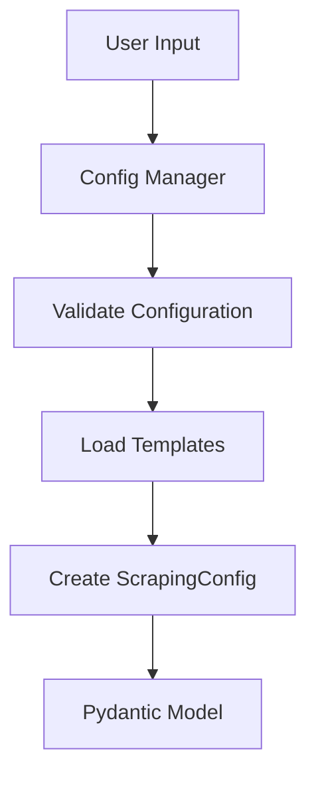
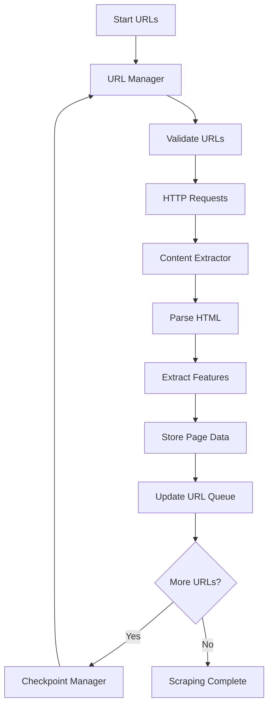
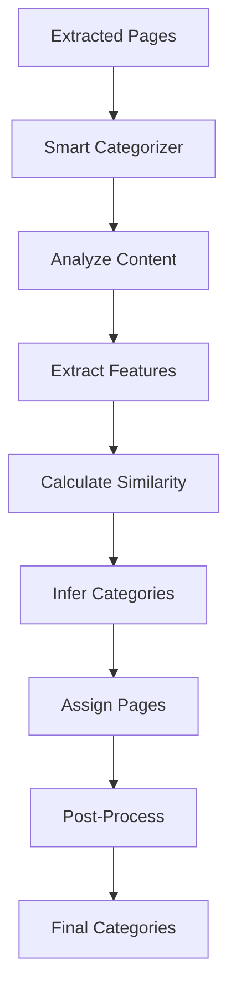
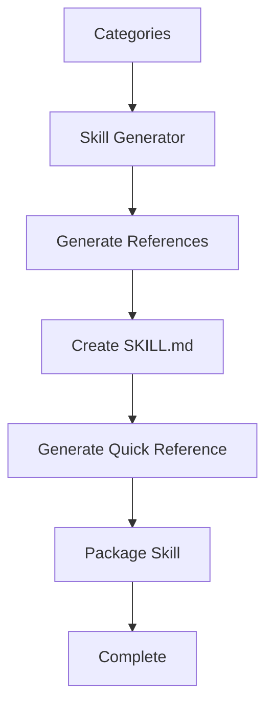

# Modular Documentation Scraper - Architecture Guide

## Overview

This document describes the architecture of the modular documentation scraper, a complete refactoring of the monolithic 1,042-line `doc_scraper.py` into specialized components using our 200-300x optimization stack.

## Architecture Principles

### 1. Single Responsibility Principle
Each module has one clear responsibility and well-defined interface.

### 2. Type Safety First
All data structures use Pydantic models with comprehensive validation.

### 3. Async-First Design
All I/O operations use async/await patterns for maximum performance.

### 4. Comprehensive Error Handling
Every module includes robust error handling and recovery mechanisms.

### 5. Test-Driven Development
Each module includes comprehensive unit and integration tests.

## Module Architecture

```
┌─────────────────────────────────────────────────────────────────┐
│                        Client Layer                        │
├─────────────────────────────────────────────────────────────────┤
│  CLI Module (scraper/cli/main.py)                              │
│  - Argument parsing                                            │
│  - Session management                                         │
│  - Progress reporting                                        │
├─────────────────────────────────────────────────────────────────┤
│                    Orchestration Layer                      │
├─────────────────────────────────────────────────────────────────┤
│  Core Scraper (scraper/core/scraper.py)                       │
│  - Session orchestration                                      │
│  - Module coordination                                       │
│  - Error handling and recovery                               │
├─────────────────────────────────────────────────────────────────┤
│                    Processing Pipeline                         │
├─────────────────────────────────────────────────────────────────┤
│  URL Manager (scraper/core/url_manager.py)                     │
│  ├─ URL validation and filtering                              │
│  ├─ Queue management                                         │
│  └─ Robots.txt compliance                                     │
│                                                               │
│  Content Extractor (scraper/extractors/content.py)             │
│  ├─ HTML parsing and content extraction                        │
│  ├─ Language detection                                       │
│  ├─ Pattern extraction                                       │
│  └─ Feature extraction                                        │
│                                                               │
│  Smart Categorizer (scraper/categorizers/smart.py)             │
│  ├─ Content analysis                                         │
│  ├─ Similarity calculation                                   │
│  ├─ Category inference                                       │
│  └─ Post-processing                                          │
│                                                               │
│  Skill Generator (scraper/generators/skill.py)                │
│  ├─ Reference file generation                                │
│  ├─ SKILL.md creation                                       │
│  └─ Quick reference compilation                               │
├─────────────────────────────────────────────────────────────────┤
│                    Storage & Persistence                       │
├─────────────────────────────────────────────────────────────────┤
│  Checkpoint Manager (scraper/storage/checkpoint.py)            │
│  ├─ Atomic checkpoint operations                             │
│  ├─ Progress persistence                                      │
│  ├─ Configuration validation                                 │
│  └─ Backup and recovery                                      │
├─────────────────────────────────────────────────────────────────┤
│                    Configuration Layer                         │
├─────────────────────────────────────────────────────────────────┤
│  Config Manager (scraper/config/manager.py)                    │
│  ├─ Template-based configuration                             │
│  ├─ Interactive configuration builder                         │
│  ├─ Validation and recommendations                          │
│  └─ Configuration caching                                    │
├─────────────────────────────────────────────────────────────────┤
│                        Data Models                            │
├─────────────────────────────────────────────────────────────────┤
│  Models (scraper/models.py)                                    │
│  ├─ 25+ Pydantic models                                      │
│  ├─ Type-safe data structures                                 │
│  ├─ Validation and serialization                            │
│  └─ JSON encoding/decoding                                   │
└─────────────────────────────────────────────────────────────────┘
```

## Data Flow

### 1. Configuration Phase


### 2. Scraping Phase


### 3. Categorization Phase


### 4. Generation Phase


## Module Interfaces

### Core Interfaces

#### IScraper
```python
class IScraper:
    async def scrape_all(self) -> ScrapingResult
    async def categorize_pages(self) -> Dict[str, Category]
    async def build_skill(self, categories: Dict[str, Category]) -> bool
```

#### IURLManager
```python
class IURLManager:
    def add_url(self, url: str, source: Optional[str] = None) -> bool
    def get_next_url(self) -> Optional[str]
    def mark_url_completed(self, url: str, success: bool = True) -> None
    def extract_links_from_content(self, url: str, html_content: str) -> List[Link]
```

#### IContentExtractor
```python
class IContentExtractor:
    def extract_page(self, url: str, html_content: str) -> ExtractedPage
    def validate_extraction(self, page: ExtractedPage) -> List[str]
    def get_extraction_stats(self, pages: List[ExtractedPage]) -> Dict[str, Any]
```

#### ICategorizer
```python
class ICategorizer:
    def categorize_pages(self, pages: List[ExtractedPage]) -> Dict[str, Category]
    def get_categorization_statistics(self, categories: Dict[str, Category]) -> Dict[str, Any]
```

#### ICheckpointManager
```python
class ICheckpointManager:
    def save_checkpoint(self, data: CheckpointData) -> bool
    def load_checkpoint(self) -> Optional[CheckpointData]
    def should_save_checkpoint(self, pages_since_last_save: int) -> bool
    def clear_checkpoint(self) -> bool
```

## Performance Optimizations

### 1. Async/Await Patterns
All I/O operations use async/await for concurrent processing:

```python
async def process_pages_concurrently(pages: List[str]) -> List[ExtractedPage]:
    """Process multiple pages concurrently."""
    semaphore = asyncio.Semaphore(10)  # Limit concurrent requests

    async def process_single_page(url: str) -> ExtractedPage:
        async with semaphore:
            return await self.extract_page(url)

    tasks = [process_single_page(url) for url in pages]
    return await asyncio.gather(*tasks)
```

### 2. Smart Caching
Frequently accessed data is cached to avoid redundant operations:

```python
class URLManager:
    def __init__(self, config: ScrapingConfig):
        self._url_cache: Dict[str, bool] = {}
        self._robots_cache: Optional[RobotFileParser] = None
        self._cache_timestamps: Dict[str, float] = {}
```

### 3. Batch Processing
Operations are batched for efficiency:

```python
async def batch_extract_features(self, pages: List[ExtractedPage]) -> Dict[str, Dict]:
    """Extract features from multiple pages efficiently."""
    batch_size = 50
    features = {}

    for i in range(0, len(pages), batch_size):
        batch = pages[i:i + batch_size]
        batch_features = await self._extract_features_batch(batch)
        features.update(batch_features)

    return features
```

### 4. Lazy Loading
Heavy objects are loaded only when needed:

```python
class ContentExtractor:
    @property
    def language_detector(self) -> LanguageDetector:
        """Lazy load language detector."""
        if not self._language_detector:
            self._language_detector = LanguageDetector()
        return self._language_detector
```

## Error Handling Strategy

### 1. Graceful Degradation
Modules continue to operate even when individual components fail:

```python
async def extract_with_fallback(self, url: str) -> Optional[ExtractedPage]:
    """Extract content with multiple fallback strategies."""
    try:
        return await self._extract_primary(url)
    except PrimaryExtractorError:
        try:
            return await self._extract_fallback(url)
        except FallbackExtractorError:
            logger.warning(f"Failed to extract {url}")
            return None
```

### 2. Error Aggregation
Errors are collected and reported comprehensively:

```python
class ErrorCollector:
    def __init__(self):
        self.errors: List[ErrorInfo] = []
        self.error_counts: Dict[str, int] = defaultdict(int)

    def add_error(self, error: ErrorInfo) -> None:
        self.errors.append(error)
        self.error_counts[error.error_type] += 1
```

### 3. Recovery Mechanisms
Automatic recovery from transient failures:

```python
async def retry_with_backoff(self, operation: Callable, max_retries: int = 3) -> Any:
    """Retry operation with exponential backoff."""
    for attempt in range(max_retries):
        try:
            return await operation()
        except (NetworkError, TimeoutError) as e:
            if attempt == max_retries - 1:
                raise
            delay = 2 ** attempt
            await asyncio.sleep(delay)
```

## Type Safety

### Pydantic Models
All data structures use Pydantic for validation and serialization:

```python
class ExtractedPage(BaseModel):
    url: str = Field(..., description="Page URL")
    title: str = Field(..., description="Page title")
    content: str = Field(..., min_length=1, description="Main content")
    headings: List[Heading] = Field(default_factory=list)
    code_samples: List[CodeSample] = Field(default_factory=list)

    class Config:
        json_encoders = {datetime: lambda v: v.isoformat()}
```

### Type Hints
Comprehensive type hints throughout the codebase:

```python
def categorize_pages(
    self,
    pages: List[ExtractedPage]
) -> Dict[str, Category]:
    """Categorize pages using smart algorithms."""
    # Implementation with full type safety
```

## Testing Strategy

### 1. Unit Tests
Each module is tested in isolation:

```python
class TestURLManager(unittest.TestCase):
    def setUp(self):
        self.config = ScrapingConfig(
            name="test",
            base_url="https://example.com/",
            max_pages=10
        )
        self.url_manager = URLManager(self.config)

    def test_url_validation(self):
        self.assertTrue(self.url_manager.add_url("https://example.com/page"))
        self.assertFalse(self.url_manager.add_url("https://other.com/page"))
```

### 2. Integration Tests
Module interactions are tested:

```python
class TestScraperIntegration(unittest.TestCase):
    async def test_end_to_end_scraping(self):
        # Test complete scraping pipeline
        config = load_test_config()
        scraper = DocumentationScraper(config)

        result = await scraper.scrape_all()
        self.assertTrue(result.success)
        self.assertGreater(result.stats.total_pages_extracted, 0)
```

### 3. Performance Tests
Performance benchmarks are maintained:

```python
class TestPerformance(unittest.TestCase):
    def test_url_processing_speed(self):
        # Test URL processing speed meets targets
        start_time = time.time()

        for _ in range(1000):
            self.url_manager.add_url(generate_test_url())

        duration = time.time() - start_time
        self.assertLess(duration, 1.0)  # Should process 1000 URLs in < 1 second
```

## Configuration System

### 1. Template-Based Configuration
Predefined templates for common frameworks:

```python
FRAMEWORK_TEMPLATES = {
    "react": {
        "selectors": {"main_content": "article"},
        "categories": {
            "getting_started": ["introduction", "installation"],
            "components": ["components", "hooks"]
        }
    }
}
```

### 2. Interactive Configuration
User-friendly configuration builder:

```python
def create_interactive_config() -> ScrapingConfig:
    """Guide user through interactive configuration."""
    config_data = {}

    # Basic information
    config_data["name"] = input("Skill name: ")
    config_data["base_url"] = input("Base URL: ")

    # Advanced options
    config_data["max_pages"] = int(input("Max pages (default 500): ") or 500)

    return ScrapingConfig(**config_data)
```

### 3. Configuration Validation
Comprehensive validation with detailed feedback:

```python
def validate_config(config: ScrapingConfig) -> ValidationResult:
    """Validate configuration with detailed feedback."""
    errors = []
    warnings = []

    # Check required fields
    if not config.name or len(config.name) < 2:
        errors.append("Name must be at least 2 characters")

    # Check URL accessibility
    if not await _check_url_accessible(config.base_url):
        warnings.append("Base URL may not be accessible")

    return ValidationResult(is_valid=len(errors) == 0, errors=errors, warnings=warnings)
```

## Extension Points

### 1. Custom Extractors
Implement IContentExtractor for custom content extraction:

```python
class CustomExtractor(IContentExtractor):
    def extract_page(self, url: str, html_content: str) -> ExtractedPage:
        # Custom extraction logic
        pass
```

### 2. Custom Categorizers
Implement ICategorizer for custom categorization:

```python
class CustomCategorizer(ICategorizer):
    def categorize_pages(self, pages: List[ExtractedPage]) -> Dict[str, Category]:
        # Custom categorization logic
        pass
```

### 3. Custom Storage
Implement IStorageProvider for custom storage backends:

```python
class DatabaseStorage(IStorageProvider):
    def save_page(self, page: ExtractedPage) -> bool:
        # Save to database
        pass
```

## Monitoring and Observability

### 1. Metrics Collection
Comprehensive metrics throughout the pipeline:

```python
class MetricsCollector:
    def __init__(self):
        self.metrics = {
            'urls_processed': 0,
            'pages_extracted': 0,
            'extraction_time': [],
            'categorization_time': [],
            'errors': []
        }

    def record_extraction_time(self, duration: float) -> None:
        self.metrics['extraction_time'].append(duration)

    def get_performance_summary(self) -> Dict[str, Any]:
        return {
            'average_extraction_time': statistics.mean(self.metrics['extraction_time']),
            'total_errors': len(self.metrics['errors']),
            'success_rate': self._calculate_success_rate()
        }
```

### 2. Progress Reporting
Real-time progress updates:

```python
class ProgressReporter:
    def __init__(self, total_pages: int):
        self.total_pages = total_pages
        self.processed_pages = 0

    def update_progress(self, processed: int) -> None:
        self.processed_pages = processed
        percentage = (processed / self.total_pages) * 100
        print(f"Progress: {percentage:.1f}% ({processed}/{self.total_pages})")
```

### 3. Health Checks
System health monitoring:

```python
async def health_check(self) -> Dict[str, str]:
    """Check system health."""
    health_status = {
        'url_manager': 'healthy',
        'content_extractor': 'healthy',
        'categorizer': 'healthy',
        'checkpoint_manager': 'healthy'
    }

    # Check individual components
    try:
        await self.url_manager.get_next_url()
    except Exception:
        health_status['url_manager'] = 'unhealthy'

    return health_status
```

This architecture provides a solid foundation for a high-performance, maintainable documentation scraper that can be easily extended and customized for different use cases.